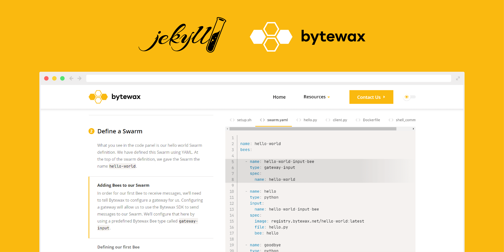

# bytewax-docs



Jekyll theme originally built for [Bytewax Docs](https://docs.bytewax.io/).

Updating the content requires basic knowledge of [Markdown](https://www.markdownguide.org/getting-started/). If you want also to modify theme style or behaviour, you'll need to use [SCSS](https://sass-lang.com/), [jQuery](https://jquery.com/) & [Liquid](https://jekyllrb.com/docs/liquid/).

## Installation

### Using as a gem-based theme

Add this line to your Jekyll site's `Gemfile`:

```ruby
gem "bytewax-docs"
```

And add this line to your Jekyll site's `_config.yml`:

```yaml
theme: bytewax-docs
```

And then execute:

    $ bundle

Or install it yourself as:

    $ gem install bytewax-docs

### Using as a regular theme (recommended)

You can both [convert gem-based theme](https://jekyllrb.com/docs/themes/#converting-gem-based-themes-to-regular-themes) or simply copy all theme files into your Jekyll site directory.

> **Note:** customizing a theme may require all its files, which are not included in site's directory while using gem-based theme. 

## Configuration

General site configuration can be changed by modifying `_config.yml`. You'll find there:
- **SEO-related settings**: site title, description, keywords etc.
- **Appearance / brand settings**: e.g. logo, favicon, mobile theme colour
- **External plugins / scripts** settings, like Google Analytics
- **Jekyll configuration** settings

> **Important:** You need to restart your server after modifying the `_config.yml` file to see your changes applied.

Rest of configuration files are located in `_data` folder, where you can adjust:
- `navbar.yml` - main site navigation, located in top navbar,
- `footer.yml` - modify site footer content & menus,
- `categories.yml` - specify order / hierarchy of the docs categories,
- `cookies.yml` - show or hide cookie consent popup, define its content and Privacy Policy link (important to make your site GDPR complaint).

## Customizing the theme

### Scripts & styles

1. Our theme uses gulp for **preprocessing, concatenating & minifying files** after each change in SCSS or JS partial file. Use `npm install` to download all required node.js modules.
2. Run the default gulp task: `gulp`. Then you should take a look in the `_assets` folder and its subfolders:
- In the `scss` folder you'll find theme styles written using [SCSS](https://sass-lang.com/). They're split into small partials, each responsible for other parts of the website. Files used throughout the whole theme are stored in the `global` subfolder, where are located e.g. variables, mixins & typography styles. 
- Theme scripts are located in `js` folder, where you'll find partials responsible for each part of website. Most of them use jQuery syntax. External libraries or plugins are stored in the `lib` subfolder, which is higher in script concatenation order.

### Layout

Modyfing theme layout requires basic knowledge of [HTML5](https://developer.mozilla.org/pl/docs/Web/Guide/HTML/HTML5) and [Liquid](https://jekyllrb.com/docs/liquid/) templating language. Layout files can be found in two folders:
- `_layouts` contain general layout files, with smaller components attached using [include tag](https://jekyllrb.com/docs/includes/)
- in the `_includes` folder, you'll find components used throughout the whole website. Global components are located in the main folder, local ones are in subfolders with corresponding names, e.g. components used only in the tutorials are located in the `tutorials` subfolder.

## Usage

### Updating the Docs

Docs articles are stored in the `_docs` folder within category subfolders. Each articles starts with short metadata options, defined in [front matter block](https://jekyllrb.com/docs/front-matter/). Metadata contain:
- Article title
- Category of the article, which should be consistent with its subfolder.
- Order of article within category

> **Important:** Order value should be a number, starting from 0. The only exclusion to this rule is the article that is shown on the main Docs (/docs/) page, which is always set to -1.

```
---
title: Place article title here
category: Category name
order: 1
---
```

### Editing the content

Docs articles should be written in [Markdown syntax](https://www.markdownguide.org/cheat-sheet/), however you can also use HTML in separated lines if needed.

If you want to add **alert** within the docs article, use following `include` tag:
```

```
Each alert has three parameters:
- type:
    - primary
    - secondary
    - info
    - warning
    - success
    - error
- icon - name of the icon from [Material Icons](https://material.io/resources/icons/) library
- content - where you add its content, HTML tags can be applied

### Categories order

If you want to change order of categories in the sidebar menu, you need to modify `_data/categories.yml` file.

### Tutorials

Tutorial articles are located in the `_tutorials` folder. You can duplicate an existing article and repopulate it with your content, or create a new one from scratch. Each article should start with **front-matter block:**
```
---
title: Example case study
description: Here you can add a short description about the article.
snippets:
  - url: path/to/code_snippet.py
    name: code_snippet.py
    id: code-snippet
notebooks:
  - url: path/to/notebook.ipynb
    name: notebook.ipynb
    id: notebook
github-url: https://github.com/bytewax/example-repository
download-url: example.zip
featured-image: assets/img/example.png
featured-image-alt: Example image alt text
---
```
- Snippets & notebooks arrays can contain few files, each as an object with three parameters: 
    - url (path to the file)
    - name (filename visible in tab)
    - id (used for highlighting selected code lines)
- If you want to display **Fork on GitHub** button, add the link to the repository as a value of `github-url` parameter.
- If users should be allowed to download the whole project, add the path to it as a value of `download-url` parameter.
- Case studies archive displays featured images along with each article's title & excerpt.  Use `featured-image` to add its path and `featured-image-alt` to provide its alternative text.

### Highlighting the code snippets

Although case studies articles content should be written in markdown syntax, just as the blog posts and pages, code highlighting requires specific line added after each paragraph:

```
**Paragraph title, or step headline**
Lorem ipsum dolor sit amet, consectetur adipiscing elit. Curabitur tristique libero et sapien dictum, eget aliquet purus lacinia. Suspendisse potenti.
{: data-highlight="1-3" data-snippet="code-snippet"}
```
That [Block IAL](https://kramdown.gettalong.org/syntax.html#block-ials) line, wrapped in braces & starting with colon should have inside:
- **data-highlight** attribute specifies which lines of code snippets should be highlighted after clicking on the paragraph
- **data-snippet** attribute should contain `id` parameter of the snippet linked to the paragraph

### Static files

Static files (e.g. images) are located in `assets` folder. You can put there your files and then link to their path using `assets/your filename.ext`.

## Plugins

Theme uses following plugins / libraries:
- [Prism](https://prismjs.com/) for syntax highlighting,
- [Marked](https://marked.js.org/) as a markdown parser & compiler,
- [Notebook.js](https://github.com/jsvine/notebookjs) for rendering Jupyter Notebooks,
- [Simple Jekyll Search](https://github.com/christian-fei/Simple-Jekyll-Search) to add search functionality,
- [jQuery Scrollspy](https://github.com/sxalexander/jquery-scrollspy) to add scrollspy function (used in docs template),
- [jQuery](https://jquery.com/) to simplify all actions performed on DOM,
- [stylelint](https://stylelint.io/) & [stylelint-config-rational-order](https://www.npmjs.com/package/stylelint-config-rational-order) to make SASS code cleaner & better readable.

## Contributing

Bug reports and pull requests are welcome on [GitHub](https://github.com/bytewax/bytewax-docs). This project is intended to be a safe, welcoming space for collaboration, and contributors are expected to adhere to the [Contributor Covenant](http://contributor-covenant.org) code of conduct.

## License

The theme is available as open source under the terms of the [MIT License](https://opensource.org/licenses/MIT).